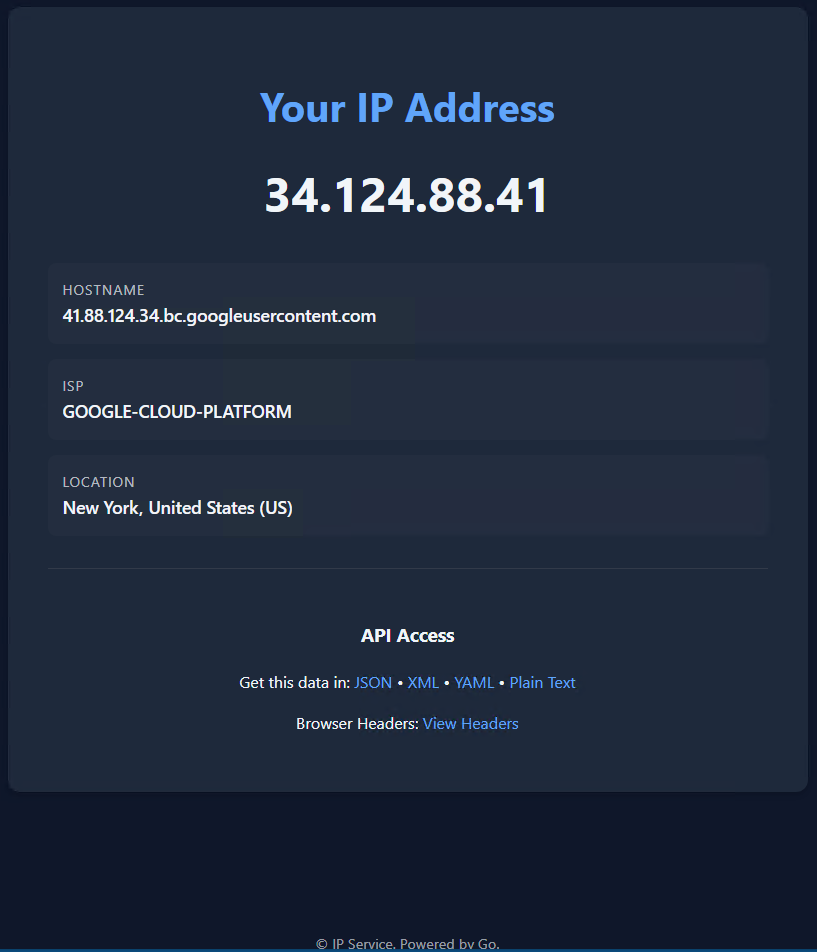

# IP Echo Service

A professional, lightweight IP address lookup service with geolocation, built in Go.



## ⚠️ Prerequisites

- **Docker** (for local deployment) or **Google Cloud SDK** (for Cloud Run)
- **MaxMind Account** (free) - Required for GeoIP features (city, country, ISP lookup)
  - Sign up: https://www.maxmind.com/en/geolite2/signup
  - You'll need your **Account ID** and **License Key**

> Without MaxMind credentials, the service still works but only returns IP and hostname.

## 🚀 Quick Start (Docker)

```bash
# 1. Clone and run setup (will prompt for MaxMind license key)
./setup.sh

# 2. Start the service
docker compose up -d --build

# 3. Test it
curl http://localhost:8090/json
```

## ☁️ Cloud Run Deployment

For serverless deployment with automatic HTTPS:

```bash
# 1. Build and push image
cd service
gcloud builds submit --tag us-east1-docker.pkg.dev/YOUR_PROJECT/cloud-run-source-deploy/ip-echo-service

# 2. Deploy with MaxMind credentials as environment variables
gcloud run deploy ip-echo-service \
  --image us-east1-docker.pkg.dev/YOUR_PROJECT/cloud-run-source-deploy/ip-echo-service \
  --region us-east1 \
  --allow-unauthenticated \
  --set-env-vars "MAXMIND_ACCOUNT_ID=YOUR_ACCOUNT_ID,MAXMIND_LICENSE_KEY=YOUR_LICENSE_KEY"
```

GeoIP databases are automatically downloaded at container startup.

## ✨ Features

- **Multiple Formats**: JSON, XML, YAML, Plain Text, HTML
- **GeoIP Lookup**: City, country, ISP (requires MaxMind)
- **Rate Limited**: 10 requests/10 seconds per IP
- **CORS Enabled**: Use from browser JavaScript
- **Secure**: Non-root container, security headers, path traversal protection
- **Dark Mode**: Automatic based on system preference

## 🌍 API Endpoints

| Endpoint | Description |
|----------|-------------|
| `/` | HTML interface (or plain text for curl) |
| `/json` | JSON response |
| `/yaml` | YAML response |
| `/xml` | XML response |
| `/text` | Plain text IP only |
| `/headers` | View HTTP headers |

**Example JSON response:**
```json
{
  "ip_address": "203.0.113.42",
  "hostname": "server.example.com",
  "isp": "Example ISP",
  "city": "San Francisco",
  "country": "United States",
  "country_code": "US"
}
```

## 🔧 Other Deployment Options

**Production (port 80):**
```bash
docker compose -f docker-compose.prod.yaml up -d
```

**With TLS/HTTPS:**
```bash
docker run -d -p 443:8443 \
  -v /path/to/certs:/certs:ro \
  ip-service \
  ./ip-service -tls -cert /certs/fullchain.pem -key /certs/privkey.pem -addr :8443
```

**Behind Nginx:**
```nginx
location / {
    proxy_pass http://127.0.0.1:8090;
    proxy_set_header X-Forwarded-For $proxy_add_x_forwarded_for;
}
```

## 🛡️ Security

- Rate limiting (10 req/10sec per IP)
- CORS support for browser APIs
- Security headers (CSP, X-Frame-Options, etc.)
- Path traversal protection
- Non-root container user
- Resource limits (CPU/RAM)

See [SECURITY.md](./SECURITY.md) for details.

## 📚 Documentation

- [DOCUMENTATION.md](./DOCUMENTATION.md) - Full API reference, deployment scenarios
- [SECURITY.md](./SECURITY.md) - Security features guide
- [QUICKREF.md](./QUICKREF.md) - Quick reference card

## 📋 Changelog

### v1.1.0 (2026-01-19)
- **Fixed**: ISP/ASN lookup now works with GeoLite2-ASN database
- **Added**: Google Cloud Run deployment support
- **Added**: New globe favicon
- **Improved**: Vertical layout for info display

### v1.0.0
- Initial release

## 📝 License

MIT License - See [LICENSE](./LICENSE)

## Acknowledgments

Built upon the original [wtfismyip](https://codeberg.org/wtfismyip/wtfismyip) project.
